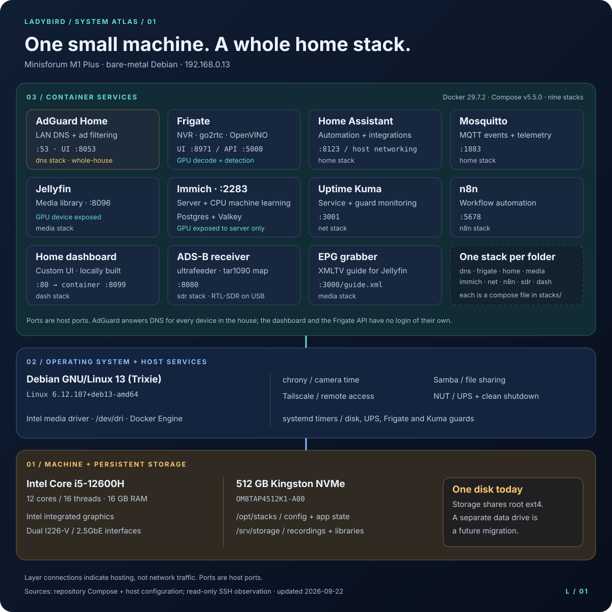
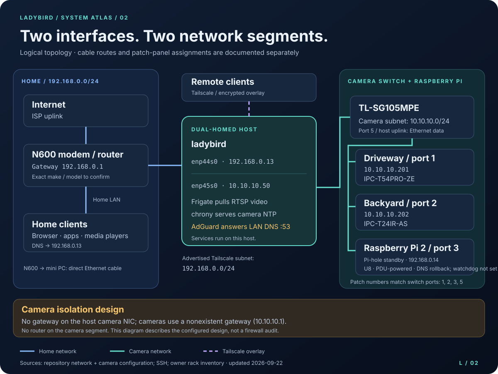
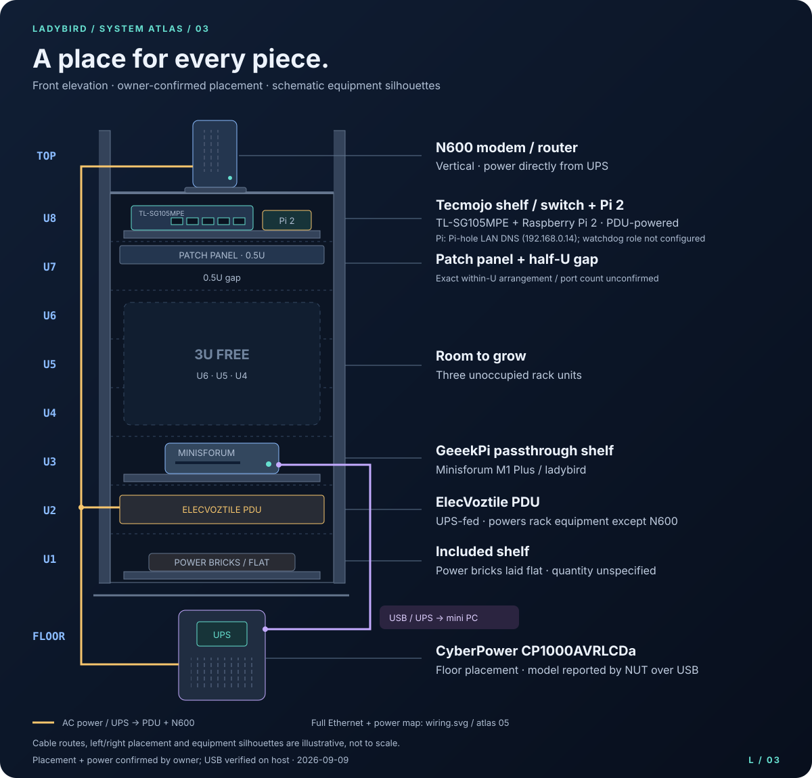
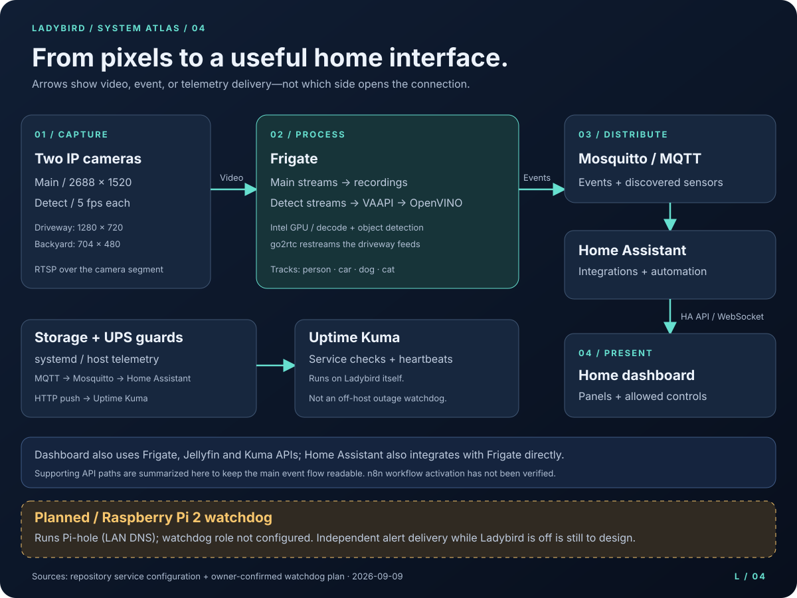
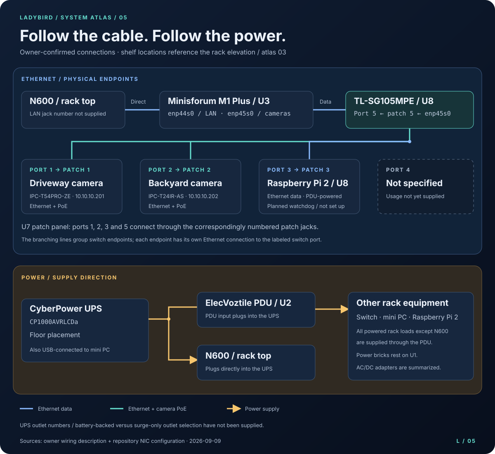

# Ladybird system atlas

Five complementary views of the home lab, designed for the repository README and a future tutorial site.
The SVG files are the editable source and the publication assets: no export step, font download,
JavaScript, or diagramming service is required. Open any image on its own to zoom into the details.

## 01 · Inside Ladybird

The hosting view separates Docker workloads from services installed directly on Debian. GPU exposure
is called out separately from CPU machine learning. `/srv/storage` currently shares the root
filesystem; a dedicated data drive is a future migration, not installed hardware.

## 02 · Network topology

This is a **logical network view**; the detailed patching schedule is in view 05. The N600 connects
directly to the host LAN NIC. The other host NIC connects to port/patch 5 of the camera switch,
which also connects the two cameras and Raspberry Pi 2. The Pi is not yet configured: its IP
address, OS and notification route are not established. The Tailscale line represents an overlay,
not another physical cable. Link colors identify networks, not negotiated speeds or Pi PoE power.

## 03 · Rack elevation

| Position | Owner-confirmed occupant |
|---|---|
| Top | N600 modem/router, vertical |
| U8 | Tecmojo shelf → TP-Link TL-SG105MPE + Raspberry Pi 2 |
| U7 | 0.5U patch panel + 0.5U gap |
| U6–U4 | Free |
| U3 | GeeekPi passthrough shelf → Minisforum M1 Plus |
| U2 | ElecVoztile PDU |
| U1 | Included shelf → power bricks laid flat |
| Floor | CyberPower CP1000AVRLCDa UPS |

The USB telemetry connection between UPS and mini PC is verified. The UPS supplies the PDU and
directly supplies the N600; all other powered rack equipment, including the Pi, plugs into the PDU.
Drawn cable routes and left-to-right equipment placement are illustrative.
Equipment silhouettes do not specify dimensions, outlet counts, or the number of power bricks.
The exact arrangement of the two half-U portions within U7 is not confirmed.

### Connection inventory

Physical endpoints and patch numbers below are owner-confirmed. Exact outlet numbers and cable
specifications are optional inventory details still to collect.

| Connection / detail | What is known | What is missing |
|---|---|---|
| Mini PC LAN | Direct N600 → `enp44s0`, `192.168.0.13/24` | N600 LAN jack number, cable details |
| Mini PC camera uplink | Switch port 5 → patch 5 → `enp45s0`, `10.10.10.50/24` | Cable details |
| Driveway camera | Switch port 1 → patch 1 → IPC-T54PRO-ZE, `10.10.10.201`; Ethernet + PoE | Cable details |
| Backyard camera | Switch port 2 → patch 2 → IPC-T24IR-AS, `10.10.10.202`; Ethernet + PoE | Cable details |
| Raspberry Pi 2 | Switch port 3 → patch 3 → Pi on U8; PDU-powered; not yet set up | IP, OS, monitoring software and independent notification route |
| Switch port 4 | Usage not supplied | Whether occupied or spare |
| UPS → mini PC | USB telemetry, verified through NUT | Physical USB port / cable route if desired |
| UPS / PDU / power bricks | UPS → PDU → all other powered rack equipment; N600 directly into UPS | Outlet numbers and battery-backed/surge-only outlet selection |
| Rack | Owner supplied U1–U8 layout | Make/model, width, depth |
| N600 | Owner supplied designation and placement | Manufacturer and exact model |

## 04 · Camera to dashboard

Arrows indicate delivery of video, events, or telemetry. Frigate initiates the camera stream requests.
The dashboard's other API integrations are summarized in the footer rather than drawn across the
event pipeline. n8n is running, but importing a workflow file into this repository does not establish
that the workflow is active on the server, so it is not drawn as an active notification path.

Uptime Kuma is hosted **on this same machine**. It can detect stale guard heartbeats while it is
running, but cannot send an alert after the entire host stops. The Raspberry Pi 2 is intended to
fill that gap, but it has not been set up yet.

## 05 · Physical wiring and power

Ethernet lines identify individual switch endpoints; the shared drawn branches are visual grouping,
not daisy-chained devices. Power arrows show the supply direction. AC/DC adapters are summarized
under the powered equipment rather than depicting an unverified adapter-to-outlet map.

| Switch port | U7 patch jack | Endpoint |
|---|---|---|
| 1 | 1 | Driveway IPC-T54PRO-ZE (owner's “good camera”) |
| 2 | 2 | Backyard IPC-T24IR-AS |
| 3 | 3 | Raspberry Pi 2 on U8 |
| 4 | Not supplied | Usage not specified |
| 5 | 5 | Mini PC camera NIC `enp45s0` |

### Planned Pi watchdog

The **Raspberry Pi 2 is physically installed, cabled and PDU-powered**, alongside the switch on
the Tecmojo shelf. Its intended job is to notify the owner when Ladybird crashes or powers off
unexpectedly. **No monitoring service is configured yet**, and no alert-delivery path is drawn as live.

Before implementing that role, establish an alert route that does not depend on Ladybird forwarding
traffic: the Pi currently connects to the camera-side switch, while the N600 is on Ladybird's other
NIC. Monitoring the host from the Pi and delivering an internet notification after that host fails
are separate requirements. The eventual design should preserve camera isolation and demonstrate
alert delivery with Ladybird powered off. Pi setup is future work, not part of these diagram changes.

## Evidence and freshness

Snapshot: **2026-09-09**. Distinguish observed runtime facts from repository configuration and
owner-supplied physical details when updating these diagrams.

| Subject | Evidence |
|---|---|
| PC model and rack positions | Owner's corrected rack inventory; PC model also in root README |
| Switch ports, patch jacks and power tree | Owner confirmed corresponding port/patch numbers 1, 2, 3, 5; UPS-fed PDU; N600 directly on UPS |
| Raspberry Pi | Owner confirmed Pi 2 on U8, PDU-powered, not yet configured; planned off-host watchdog |
| OS, kernel, CPU, memory, NVMe, NICs | Read-only SSH: `/etc/os-release`, `uname`, `lscpu`, `free`, `lsblk`, `lspci`, `ip` |
| Current storage mount | SSH: `findmnt -T /srv/storage` → root ext4 on `/dev/nvme0n1p2` |
| Docker and Compose versions | SSH: `docker --version`, `docker compose version` |
| Container inventory | SSH: `docker ps`; services and ports cross-checked against [`stacks/`](../../stacks/) |
| Host services | SSH: active chrony, tailscaled, smbd, nut-server and nut-monitor; active disk/UPS guard timers |
| UPS identity | SSH: `upsc cyberpower ups.model` → `CP1000AVRLCDa`; owner requested this model be used |
| Camera streams and detection | [`Frigate config`](../../stacks/frigate/config/config.yml) |
| GPU device access | Frigate, media and Immich Compose files; device exposure does not itself prove application transcoding settings |
| Network isolation design | [`Camera NIC config`](../../host/etc/network/interfaces.d/enp45s0), [`camera guide`](../cameras.md) and README topology |
| Dashboard integrations | [`Dashboard Compose`](../../stacks/dash/docker-compose.yml) and [`operations guide`](../operations.md#dashboard) |

### Runtime / documentation differences found

- **UPS:** older documentation called the unit PR1500LCDRT2U. NUT reports CP1000AVRLCDa;
  the owner's instruction is to use the NUT-reported model. Documentation and the descriptive NUT
  label now follow that identity. USB vendor/product matching is unchanged.
- **EPG:** `epg` is running from `ghcr.io/iptv-org/epg:master`. Its Compose label points to
  `/opt/stacks/media/docker-compose.yml`, but this checkout's media Compose defines only Jellyfin.
  The architecture diagram marks EPG as live-only rather than implying it can be rebuilt from this checkout.
- **n8n:** defined in the repository and observed running, though absent from the older README service list.
- **Versions:** `VERSIONS.txt` is an older capture. These diagrams use the September 9 observation;
  they do not replace the image-digest inventory.

## Reuse and visual style

- Embed using Markdown: `` from the root README.
- For a website, use ``
  and link to the full-size image. Copy the SVG assets to the site's static asset directory.
- Keep the existing `viewBox`, intrinsic dimensions, `<title>`, and `<desc>` when editing.
- The opaque navy background keeps contrast consistent in both light and dark documentation themes.
- Palette: navy `#101e34`, panel `#17273e`, text `#edf3fc`, teal `#66dfcf`, blue `#8bbcff`,
  amber `#f7c66d`, violet `#c4abff`. Connection meaning is also written in labels and captions.
- Text is real SVG text using system-font fallbacks; illustrations use native vector shapes.
- Physical wiring should be added only after confirmation, with separate labels for Ethernet,
  PoE, USB telemetry, and AC power. Avoid conflating a PoE switch uplink with a powered endpoint.

## Purchase-link inventory

Exact purchase URLs can be added here and reused in the tutorial. No seller, product variant,
price, or affiliate link has been inferred.

| Item | Identified product | Purchase URL |
|---|---|---|
| Mini PC | Minisforum M1 Plus | Awaiting owner link |
| Camera switch | TP-Link TL-SG105MPE | Awaiting owner link |
| UPS | CyberPower CP1000AVRLCDa (reported model) | Awaiting owner link |
| Watchdog hardware | Raspberry Pi 2; not yet configured | Awaiting owner link |
| Driveway camera | IPC-T54PRO-ZE | Awaiting owner link |
| Backyard camera | IPC-T24IR-AS | Awaiting owner link |
| Upper shelf | Tecmojo; exact model unknown | Awaiting owner link |
| Mini PC shelf | GeeekPi passthrough shelf; exact model unknown | Awaiting owner link |
| PDU | ElecVoztile; exact model unknown | Awaiting owner link |
| Rack + included shelf | Model unknown | Awaiting owner link |
| Patch panel | 0.5U; model unknown | Awaiting owner link |
| Modem/router | N600; exact model unknown | Awaiting owner link |
